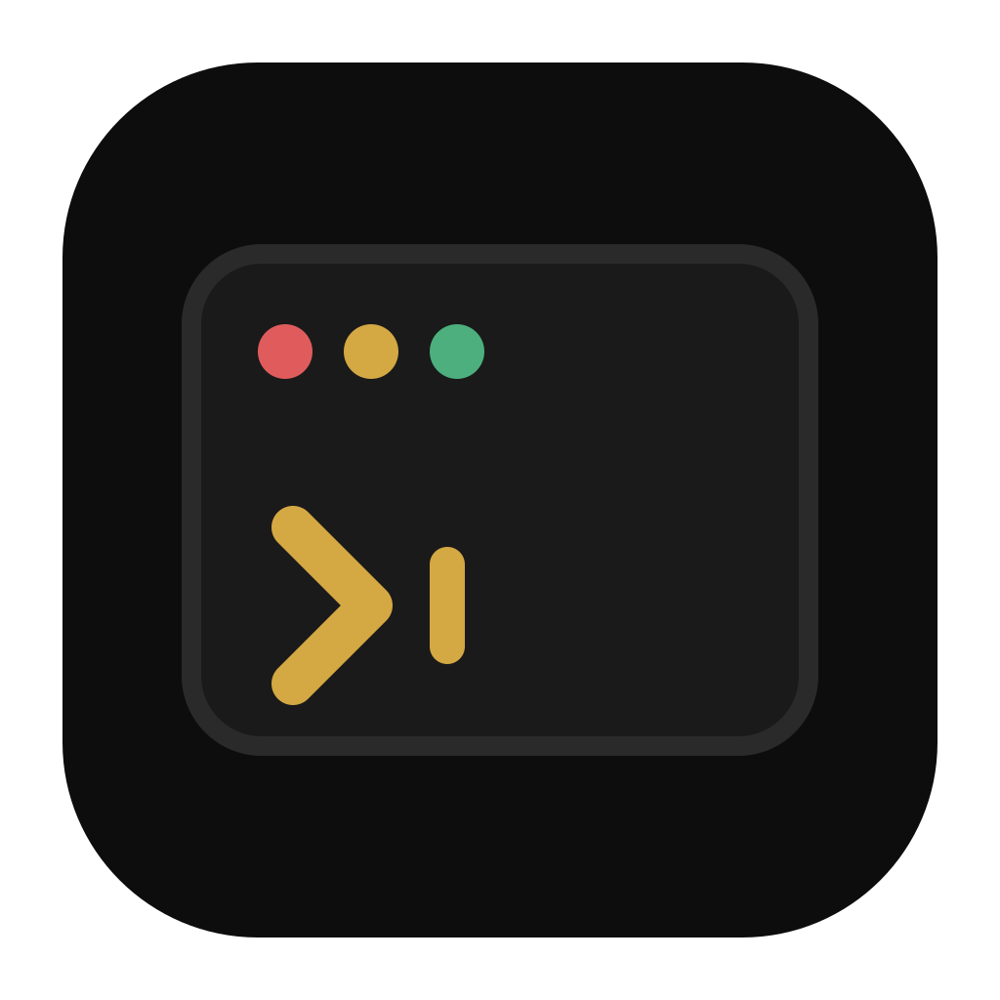
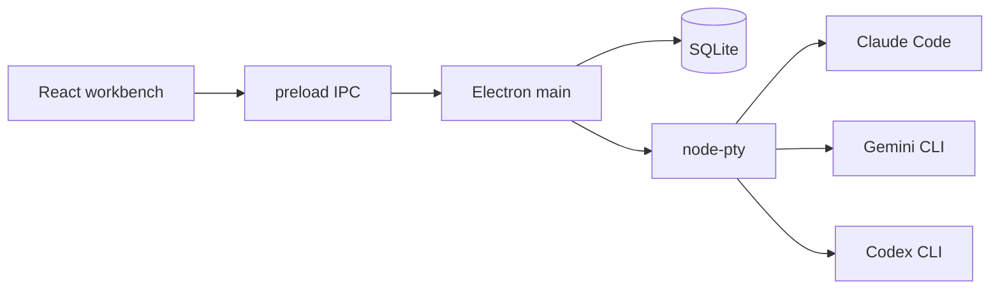

<p align="center">
  
</p>

<h1 align="center">ClaudeDesk</h1>

<p align="center">
  A desktop workbench for <strong>Claude Code</strong>, <strong>Gemini CLI</strong>, and <strong>Codex</strong>.<br>
  Run several agent sessions at once, group them by project, and keep every login in its own profile.
</p>

<p align="center">
  
  
  
  
</p>

ClaudeDesk is a local Electron app. It does not wrap the agents in a fake chat UI — it attaches a real terminal (PTY) to the official CLIs, so you get the same tools, permissions, and output you would in a normal shell, with a workbench around them.

```
┌─────────────────────────────────────────────────────────────┐
│  Claude · Gemini · Codex                      ⌘K   Settings │
├───────────┬────────────────┬────────────────────────────────┤
│ Projects  │ Sessions       │  Live agent terminal           │
│           │                │                                │
│  work     │  ● running     │  the real Claude / Gemini /    │
│  personal │  ○ idle        │  Codex CLI, in your repo       │
│  —        │  archived ▸    │                                │
└───────────┴────────────────┴────────────────────────────────┘
```

## Why it exists

Coding agents are excellent in a terminal and awkward everywhere else. One tab, one login, one folder. When you juggle a day job repo, a side project, and a second Anthropic / Google / OpenAI account, you end up with a pile of Terminal windows and no overview.

ClaudeDesk is the missing window manager for those CLIs:

- **Several sessions at once** — keep a planning thread, a refactor, and a review open without losing either PTY.
- **Named projects** — you decide the groups (`work`, `personal`, `oss`). Sessions are not inferred from the folder path. Unassigned work lands in **Uncategorized**.
- **Isolated profiles** — each profile has its own auth, config home, MCP servers, and plugins. Hit a rate limit? Migrate the session to another profile and keep going.
- **Yours, on disk** — SQLite in Electron’s user-data folder. No account, no cloud, no telemetry.

## Features

| | |
| --- | --- |
| **Multi-agent** | Claude Code (bundled), Gemini CLI, and OpenAI Codex. Gemini/Codex use a global binary when present, otherwise `npx`. |
| **Profiles** | Subscription / Google / ChatGPT login, or an API key stored with Electron `safeStorage`. |
| **Projects** | Create, rename, delete, assign on new session, or move later. Collapse unused groups. |
| **Workbench** | Three panes: Projects · Sessions · Terminal. Collapse either side pane to a rail. |
| **Live terminal** | xterm.js + `node-pty`. Dark / light / system theme, with light-mode ANSI contrast so commit hashes and env vars stay readable. |
| **Permission modes** | Default, auto-accept edits, plan (read-only), or bypass — the same modes the Claude CLI already understands. |
| **Migrate** | Hand a running conversation to another profile, with enough transcript context for the new agent to continue. |
| **Git panel** | Status, diffs, and branch switching for the session’s workspace. |
| **MCP & plugins** | Per-profile MCP servers, configured from Settings. |
| **Quick switcher** | `⌘K` / `Ctrl+K` to jump sessions or start a new one. |
| **Export** | Save a session transcript or a short summary. |

## Requirements

- **Node.js 20+** and npm
- **macOS, Windows, or Linux**
- Native build tools (needed once, for `better-sqlite3` and `node-pty`):
  - macOS: Xcode Command Line Tools (`xcode-select --install`)
  - Windows: [Visual Studio Build Tools](https://visualstudio.microsoft.com/visual-cpp-build-tools/) with the Desktop C++ workload
  - Linux: `python3`, `make`, and a C/C++ toolchain (`build-essential` on Debian/Ubuntu)
- An account for at least one agent:
  - **Claude** — Claude Code is bundled; sign in with Anthropic or paste an API key
  - **Gemini** — optional `npm i -g @google/gemini-cli`, or ClaudeDesk will run `npx -y @google/gemini-cli`
  - **Codex** — optional `npm i -g @openai/codex`, or ClaudeDesk will run `npx -y @openai/codex`

You do not need all three CLIs. Add only the providers you use.

## Quick start

```bash
git clone https://github.com/guichavesc/claudedesk.git
cd claudedesk
npm install
npm run dev
```

On first launch:

1. Create a **profile** (provider + login or API key).
2. Optionally create a **project** (`work`, `clients`, …).
3. Start a **session**: pick the folder, model, permission mode, and project.
4. Talk to the agent in the terminal. Open more sessions whenever you want.

`npm install` rebuilds native modules against Electron. If that step fails, install the toolchain above and run `npm install` again.

## Keyboard shortcuts

| Shortcut | Action |
| --- | --- |
| `⌘K` / `Ctrl+K` | Quick switcher |
| `⌘T` / `Ctrl+T` | New session |
| `⌘⇧M` / `Ctrl+Shift+M` | Migrate the active session |

macOS window chrome: double-click the empty title bar to zoom.

## Build a release

```bash
npm run build:mac    # DMG
npm run build:win    # NSIS installer
npm run build        # current platform
```

Artifacts land in `release/`. Linux produces an AppImage via the same `electron-builder` config (`npm run build` on Linux).

macOS, Windows, and Linux are all wired in the builder config. macOS and Windows are the best-tested targets today.

## How it is put together



| Layer | Role |
| --- | --- |
| `src/` | React workbench (projects, sessions, settings, xterm) |
| `electron/main.ts` | Windows, IPC, spawning PTYs, git helpers |
| `electron/providers/` | Claude / Gemini / Codex adapters (launch, env, auth, models) |
| `electron/db.ts` | Local SQLite: profiles, projects, sessions |
| `electron/handoffContext.ts` | Transcript slice used when migrating a session |

Sessions remember the workspace folder, model, permission mode, project, and which profile owns them. Archived sessions stay in the list, collapsed per project.

## Privacy

- Everything stays on your machine. There is **no ClaudeDesk account** and **no telemetry** in this repo.
- The database is `claudedesk.sqlite` inside Electron’s user-data directory.
- API keys are encrypted with Chromium `safeStorage` (OS keychain / DPAPI), not stored as plain text.
- Agent CLIs still talk to Anthropic, Google, or OpenAI the same way they would from your terminal. That traffic is theirs, not ours.

## Contributing

Issues and pull requests are welcome. A useful PR is small, matches the existing workbench (Archivo + JetBrains Mono, square corners, canvas tokens in `src/index.css`), and does not add network calls or analytics.

Practical setup:

```bash
npm install
npm run dev
npm run lint
```

If you are changing native/Electron code, quit the app fully before rebuilding — `node-pty` and `better-sqlite3` cannot reload in place.

## License

[MIT](LICENSE). ClaudeDesk is free to use, copy, and modify.

Claude Code, Gemini, Codex, and their marks belong to Anthropic, Google, and OpenAI. ClaudeDesk is an independent desktop shell around their CLIs — not affiliated with, or endorsed by, those companies.
